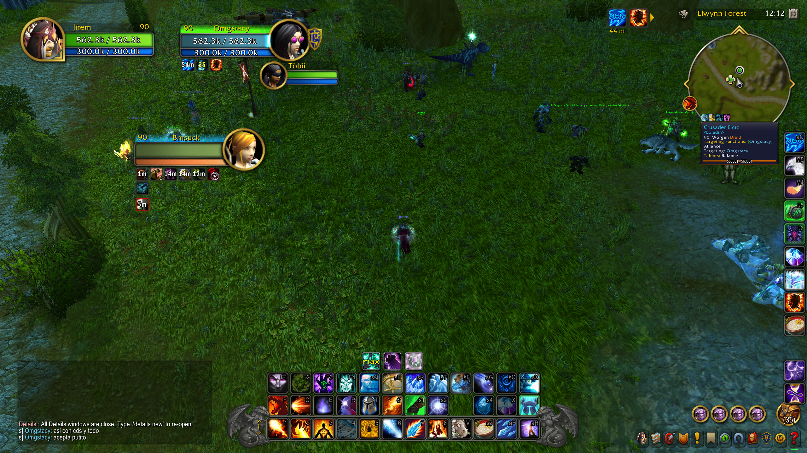
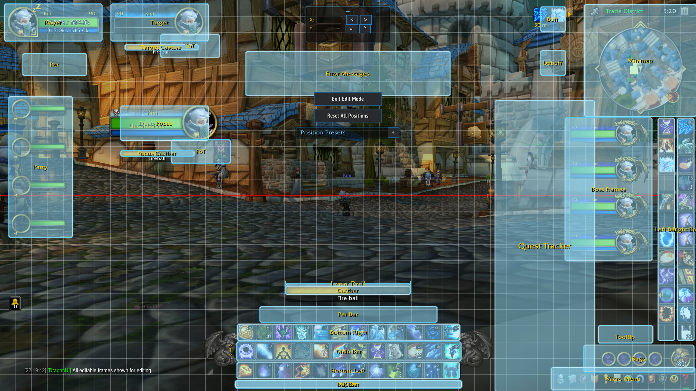
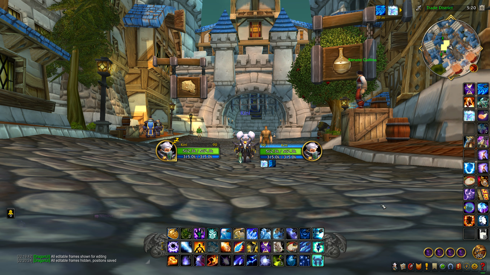
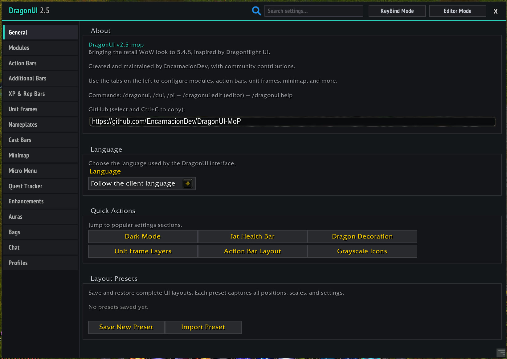

# 🐉 DragonUI for 5.4.8

<div align="center">


[](https://github.com/EncarnacionDev/DragonUI-MoP/releases/tag/v2.5-mop)
[](LICENSE)


**A modular, retail-inspired UI addon for World of Warcraft 5.4.8 (Mists of Pandaria).**

</div>

---






## 📥 Download

| Method | Link |
|--------|------|
| **Latest stable release** | [Download](https://github.com/EncarnacionDev/DragonUI-MoP/releases/download/v2.5-mop/DragonUI-MoP-2.5-mop.zip) |
| **Cutting-edge (main branch)** | [Download](https://github.com/EncarnacionDev/DragonUI-MoP/archive/refs/heads/main.zip) |

> The main branch always contains the most recent features and fixes. Releases are periodic snapshots that have been tested more thoroughly.

## 📦 Installation

<details>
<summary><strong>How to install (click to expand)</strong></summary>

1. Download the ZIP from one of the links above.
2. Extract it and open the folder.
3. Copy both `DragonUI` and `DragonUI_Options` to:

```text
World of Warcraft/Interface/AddOns/
```

4. Start the game and verify `DragonUI` and `DragonUI_Options` are enabled in the AddOns list.
5. Open settings with `/dui`.

**Clean install (reset settings):** Delete:

```text
WTF/Account/<YourAccount>/SavedVariables/DragonUI*
```

</details>

## ✨ Features

### Core UI

- 🧩 Modular system: enable or disable any major UI component independently.
- ⚙️ Custom configuration panel with profile support and per-module controls.
- ⌨️ Editor Mode: move and reposition nearly every UI element, with live X/Y coordinates and pixel-by-pixel position controls.
- 📋 Layout Presets: save, load, duplicate, delete, import, and export full UI layouts and addon settings using shareable export codes.
- 🌍 Localization for English, Spanish (ES/MX), German, Korean, Russian, Simplified Chinese, and Traditional Chinese.

### Frames And Bars

- 🎯 Action bars with configurable grid layouts, visibility rules, and button spacing.
- 💚 Unit frames for player, target, focus, party, pet, boss, ToT, and ToF, with elite dragon decoration, class portrait icons, and fat health bar mode.
- 🩹 Unit Frame Layers: heal prediction, absorb shields, and animated health loss overlays.
- 🔮 Castbars: custom castbars for player, target, and focus, with simple and detailed display modes, plus a built-in latency indicator on the player castbar.
- 📊 XP & Reputation bars with Dragonflight and RetailUI styles, independently movable.

### Visual Style

- 🖼️ HD textures for player frame (normal mode), target and focus name backgrounds. More HD assets coming in future updates.
- 🌙 Dark Mode with three intensity presets and custom color picker.
- ✨ Glow effects with separate combat and rest status controls and opacity slider.

### Inventory And Navigation

- 🎒 Auto-sort for bags and bank with slot locking, plus integrated module (Bagster) for unified inventory browsing.
- 🗺️ Custom Retail-style minimap (compatible with SexyMap).

### Utility And Quality Of Life

- 💬 Chat enhancements: style skins, fade sync, movable textbox with adjustable opacity, URL detection, chat copy, vanilla chat buttons with hover visibility, and `/tt` whisper command.
- 💎 Item quality borders, enhanced tooltips with class-colored borders, and range indicator.
- ⌨️ Easy-to-use keybinding mode on supported buttons.

Extensive customization available directly in-game through the configuration panel.

## 🔧 Commands

| Command | Action |
|---------|--------|
| `/dragonui` or `/dui` | Open the configuration panel |
| `/dragonui edit` | Toggle Editor Mode |
| `/dragonui help` | Show all available commands |
| `/duicomp` | Compatibility diagnostics |
| `/sort` | Sort your bags |
| `/tt <message>` | Whisper your current target |
| `/rl` | Reload the UI |

## ⚠️ Known Issues

- Party/raid role icons (DPS, Healer, Tank) may be lost after `/reload` in Dungeon Finder groups.
- Single-line tooltips show text overlapping the health bar.
- Party and raid scenarios require further edge-case testing.
- Some third-party addon setups may require manual module disabling.
- Found a bug? [Open an issue](https://github.com/EncarnacionDev/DragonUI-MoP/issues).

### MoP (5.4.8) fork notes

This fork targets Wrath of the Lich King's successor, Mists of Pandaria 5.4.8 (Interface 50400). A few WotLK-only features are currently disabled or stubbed out:

- Incoming heal / absorb overlays (libraries removed, pending a MoP replacement).
- Vehicle bar (MoP uses `OverrideActionBar` instead of `VehicleMenuBar`).
- Shaman multicast / totem bar (does not exist in MoP).

The SavedVariables database was renamed to `DragonUIMoPDB` to avoid clashing with WotLK profiles.

## 🙏 Credits And References

DragonUI builds on original work and adapted ideas from these addon authors and projects:

| Project | Author | Contribution |
|---------|--------|-------------|
| [Dragonflight UI (Classic)](https://github.com/Karl-HeinzSchneider) | Karl-HeinzSchneider | Primary design reference |
| [pretty_actionbar / pretty_minimap](https://github.com/s0h2x) | s0h2x | Action bar and minimap patterns |
| [RetailUI](https://github.com/a3st) | a3st (Dmitriy) | UI styling reference |
| [KPack](https://github.com/bkader/KPack) | bkader | Utility patterns |
| [Combuctor](https://github.com/Jaliborc) | Jaliborc | Bag integration |
| [BankStack](https://github.com/kemayo/) | kemayo | Bank sort logic |
| [UnitFrameLayers](https://github.com/RomanSpector) | RomanSpector | Heal/absorb overlay reference |
| [oGlow](https://github.com/haste) | haste | Item quality border reference |
| [ElvUI-WotLK](https://github.com/ElvUI-WotLK/) | ElvUI team | Pattern reference |
| [Quartz](https://github.com/Nevcairiel/Quartz) | Hendrik Leppkes | Latency indicator concept |
| [CrimsonHollow](https://github.com/CrimsonHollow) | CrimsonHollow | Fat Health Bar contribution |
| [RovBot](https://github.com/RovxBot) | RovBot | Action bar grid/preset system |
| [Raz0r](https://github.com/Raz0r1337) | Raz0r | German localization |
| [nadugi](https://github.com/nadugi) | nadugi | Korean localization |

Missing from the list? [Let me know](https://github.com/EncarnacionDev/DragonUI-MoP/issues).

## 💛 Special Thanks

- Everyone who tested early builds, reported bugs, and helped shape this addon.
- Translators who contributed localizations across different clients.
- The open-source addon community whose work made this project possible.

## 📜 License

DragonUI is released under the [MIT License](LICENSE). Bundled third-party components have their own licenses - see [`LICENSES/`](LICENSES/).

## 📎 Disclaimer

DragonUI is a free, fan-made addon. No content is sold and no in-game advantages are provided. Not affiliated with or endorsed by Blizzard Entertainment.

